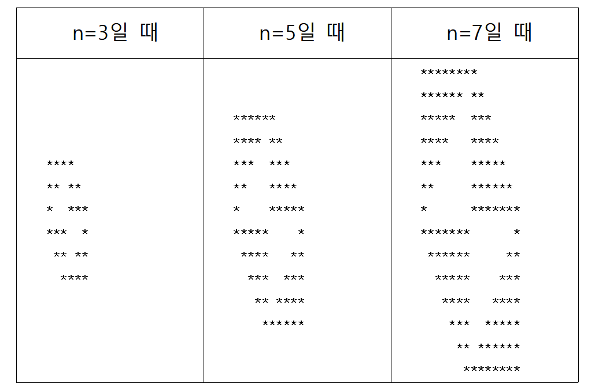

# C작점 6주차 학습 일지

## 반복문 활용문제 : 별 모양 만들기

반복문을 활용한 출력제어의 연습을 위해 일명 ‘별 찍기 문제’를 만들어서 풀어보았다. 문제의 답의 출력형태는 간단한 모양의 별무늬 네 가지를 합친 모양으로 만들었다. 자연수 n을 입력받고, 한 변 길이가 n인 직각이등변삼각형을 아래 표와 같이 네 가지 방향으로 모두 나타내야 한다. 문제의 요점은 반복문을 잘 섞어 활용하여 별(“\*”)과 공백(“ ”)의 위치와 개수를 잘 조절해서 모양을 만들어내는 것이다. C언어의 printf() 함수에는 같은 것을 특정 횟수만큼 여러 번 반복해서 출력하는 기능이 없으므로, 가로 방향의 반복과 세로 방향의 반복을 위해 이중 반복문을 활용하여야 한다. 

이중 반복문은 반복문의 내부에 반복문이 있는 것으로, 지금 해결하려는 별 찍기 문제나, 배열의 정렬 알고리즘에서 많이 활용된다. 예를 들어 가로 4, 세로 3의 12개짜리 직사각형 별(“\*”)모양을 출력하기 위해서는 이중 반복문이 for(i=0; i<3; i++){ for(j=0; j<4; j++){ printf(“\*”); } printf(“\n”); } 와 같이 사용된다. 가장 바깥쪽 for문부터 살펴보도록 하자. 바깥쪽 for문은 지금 출력하는 행이 몇 번째 행인지 세리면서, 매 행의 끝에서 줄을 바꾸어주는 역할을 한다. 위의 예시에서 세로 방향으로 3개, 즉 출력이 3줄짜리이므로 i=0번째 줄부터 i=2번째 줄까지 3번 반복하며 내부의 for문을 실행하고 printf(“\n”); 으로 줄을 바꾼다. 이제 내부의 for문을 보자. 위의 예시에서 각 줄에 별(“\*”)을 4개씩 출력해야 하므로, for문으로 j가 0에서부터 3까지, 즉 4번 반복하여 출력한다. 이로써 4×3짜리 직사각형 모양의 별(“\*”)을 출력하였다.

다시 문제로 돌아와 보자. 예시에서 총 2n개의 줄에서 중간을 기준으로 모양의 규칙이 바뀌는 것을 알 수 있다. 따라서 위쪽 n개 줄의 출력을 마치고 나서 다른 코드로 나머지 아래쪽 n개 줄의 출력을 하도록 총 두 개의 이중 반복문을 만드는 것으로 문제를 해결할 수 있을 것으로 보인다.



먼저 위쪽 n개의 줄의 별 배치의 규칙성을 찾아보자. 가로 양쪽으로 총 2n개의 칸에 세로로 반을 잘라서 보면 왼쪽 칸은 왼쪽 정렬된 별이 n개에서 1개까지 감소하고, 오른쪽 칸은 왼쪽 정렬된 별이 1개에서 n개까지 증가하는 모양이다. 그러면 이제 줄별로 관찰해보자. i=0번째 줄에서는 별(‘\*’)이 n+1개 연속으로 출력이 되는데, 이는 별(‘\*’) n개, 공백(‘ ’) 0개, 별(‘\*’) 1개의 순서로 출력되었다고 볼 수 있다. i=1번째 줄에서는 별(‘\*’) n-1개, 공백(‘ ’) 1개, 별(‘\*’) 2개의 순서로 출력되었다. i=n-1번째 줄, 즉 마지막 줄에서는 별(‘\*’) 1개, 공백(‘ ’) n-1개, 별(‘\*’) n개의 순서로 출력되었다. 따라서 일반화하면, i번째 줄에서는 별(\‘*’) n-i개, 공백(‘ ’) i개, 별(‘\*’) i+1개의 순서로 출력된다.

다음으로 아래쪽 n개의 줄의 별 배치의 규칙성을 찾아보자. 가로 양쪽으로 총 2n개의 칸에 세로로 반을 잘라서 보면 왼쪽 칸은 오른쪽 정렬된 별이 n개에서 1개까지 감소하고, 오른쪽 칸은 오른쪽 정렬된 별이 1개에서 n개까지 증가하는 모양이다. 그러면 이제 줄별로 관찰해보자. i=0번째 줄에서는 별(‘\*’) n개, 공백(‘ ’) n-1개, 별(‘\*’) 1개의 순서로 출력되었는데, 이는 공백(‘ ’) 0개, 별(‘\*’) n개, 공백(‘ ’) n-1개, 별(‘\*’) 1개의 순서로 출력되었다고 볼 수 있다. i=1번째 줄에서는 공백(‘ ’) 1개, 별(‘\*’) n-1개, 공백(‘ ’) n-2개, 별(‘\*’) 2개의 순서로 출력되었다. i=n-1번째 줄, 즉 마지막 줄에서는 공백(‘ ’)이 n-1개, 별(‘\*’)이 n+1개 연속으로 출력이 되는데, 이는 공백(‘ ’) n-1개, 별(‘\*’) 1개, 공백(‘ ’) 0개, 별(‘\*’) n개의 순서로 출력되었다고 볼 수 있다. 따라서 일반화하면, i번째 줄에서는 공백(‘ ’) i개, 별(‘\*’) n-i개, 공백(‘ ’) n-i-1개, 별(‘\*’) i+1개의 순서로 출력된다.

이렇게 별의 배치 형태의 줄에 따른 변화 규칙을 찾아내면, 이중 반복문을 통해 코드를 쉽게 작성할 수 있다. 완성된 코드는 아래의 표와 같다. 반복문을 사용할 때, for(i=0; i<반복횟수; i++) 와 같은 형태로 작성하면 반복횟수가 눈에 보이게 확인되므로 효과적으로 반복문을 활용할 수 있다.

```c
#include <stdio.h>

int main(void)
{
    int n, i, j;
    
    scanf("%d", &n);
    
    for(i=0; i<n; i++){
        for(j=0; j<n-i; j++){
            printf("*");
        }
        for(j=0; j<i; j++){
            printf(" ");
        }
        for(j=0; j<i+1; j++){
            printf("*");
        }
        printf("\n");
    }
    
    for(i=0; i<n; i++){
        for(j=0; j<i; j++){
            printf(" ");
        }
        for(j=0; j<n-i; j++){
            printf("*");
        }
        for(j=0; j<n-i-1; j++){
            printf(" ");
        }
        for(j=0; j<i+1; j++){
            printf("*");
        }
        printf("\n");
    }
    
    return 0;
}
```


## 2. 구조채의 
